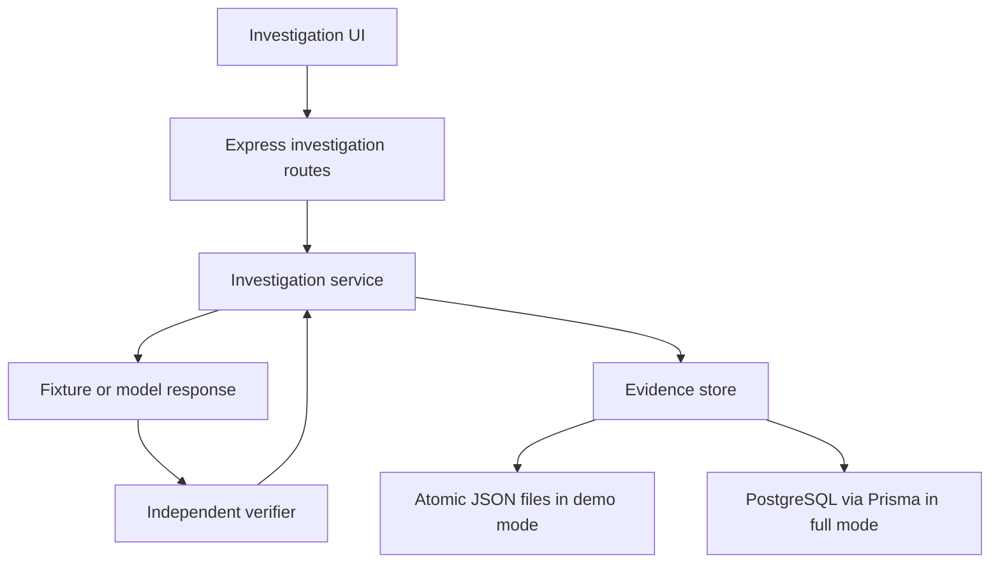

# Architecture

The React/Vite application opens to the investigation workspace. Existing task/agent/metrics screens remain available in full mode. The fixture-demo navigation shows only investigations.

## Evidence lifecycle

1. Validate source and optional parent. Reject concurrent investigations in this process.
2. Persist an attempt and its exact system/user instructions before generation.
3. Load an authored fixture or request a fresh model response with a 30-second timeout.
4. Store the candidate, its SHA-256, and provider model/usage if available.
5. Execute the candidate in a separate process. Fixture execution requires an exact match with a bundled constant; all other candidates use Docker.
6. Compare returned integer fees against host-side expected results. Empty, malformed, or interrupted verification is never a pass.
7. Save the independent execution/verification outcomes and end timestamp.

API requests await completion. Event snapshots are saved between phases. A server restart marks unfinished investigations interrupted; it does not resume or retry them. This is a deliberate single-process milestone, not a durable job queue. Run only one server per evidence store.

## Persistence

`InvestigationStore` separates domain logic from storage. Full mode uses an indexed PostgreSQL `investigations` table with a JSONB evidence document. Demo mode uses atomically replaced JSON files with UUID names. Both preserve original attempts when a correction is made. The API returns the latest 50 attempts, and individual older attempts remain addressable by ID. Storage loading and retention need further work for large histories.

The evidence document includes parent ID, scenario version, exact prompts, acceptance requirement, candidate code/hash, suite hash, source, model, token usage, results, events, and terminal states. Hashes are identifiers, not signatures. The acceptance suite hash covers the requirement and cases, not the full runtime image or OS.

## Verifier boundary

The candidate process receives test inputs, not expected answers. The host validates the returned JSON and computes each verdict. This keeps the verdict separate from an agent's self-assessment, but fixed published cases can still be overfit.

Docker receives only a temporary directory containing the candidate and harness. It has no network, writable root filesystem, capabilities, host secrets, or workspace access. Memory, CPU, process count, output, and runtime are bounded. Cleanup explicitly removes the named container because killing the CLI alone does not guarantee container termination. A daemon or cleanup failure may still require operator intervention.

No arbitrary candidate is executed locally when Docker fails. Containers share the host kernel and do not constitute a public multi-tenant hostile-code sandbox.

## Existing functionality

The original Planner → Coder → Reviewer workflow remains a sequence of model calls. Failed steps now mark subsequent queued steps skipped. Its run `succeeded` status means a response was produced; it is not the investigation verification status. GitHub publication is still separate and requires a future gate tied to the exact tested change.

Workspace reads enforce both lexical path boundaries and realpath boundaries to reject prefix-sibling and symlink escapes. Hidden file selections are rejected. These checks assume a trusted local workspace, not a filesystem being adversarially modified during a read.
